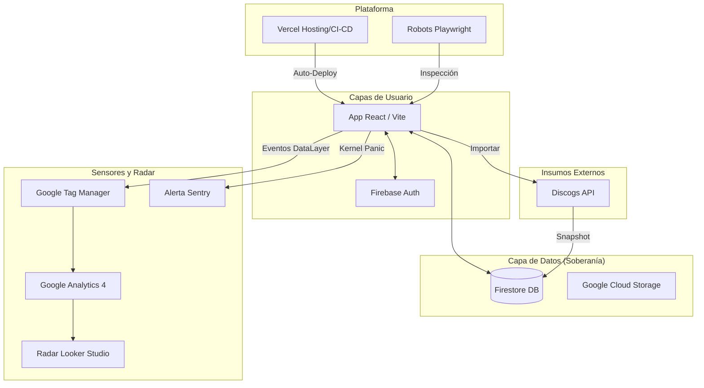

# Mapa de Dependencias del Búnker

Este diagrama ilustra cómo fluye la información y el control entre los componentes soberanos.

### Componentes Clave:
- **Admin**: Gestiona el `Looker Studio` y el `site_config`.
- **Archivo**: Unifica el catálogo global y batea privada.
- **Vercel**: Orquesta el despliegue y telemetría de plataforma.
- **Google Analytics**: Fuente primaria para el Radar de Inteligencia.
